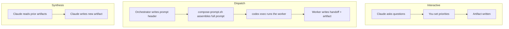
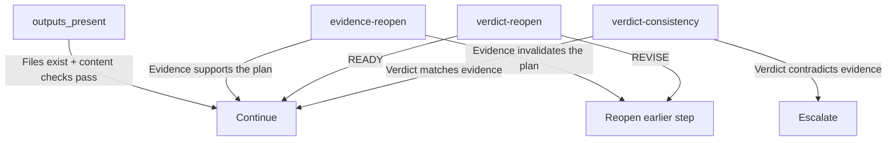
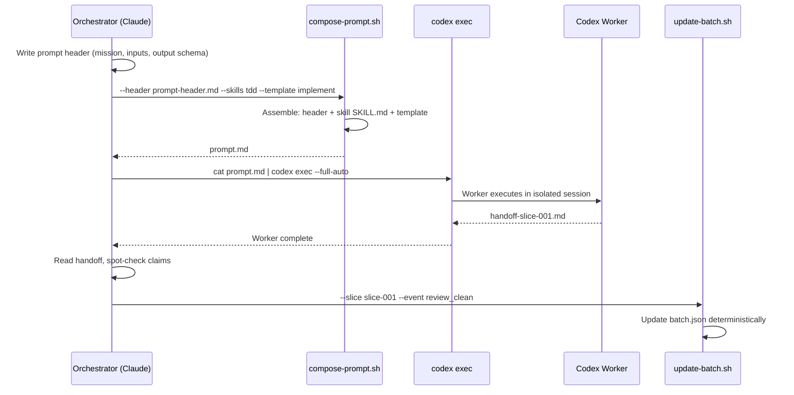
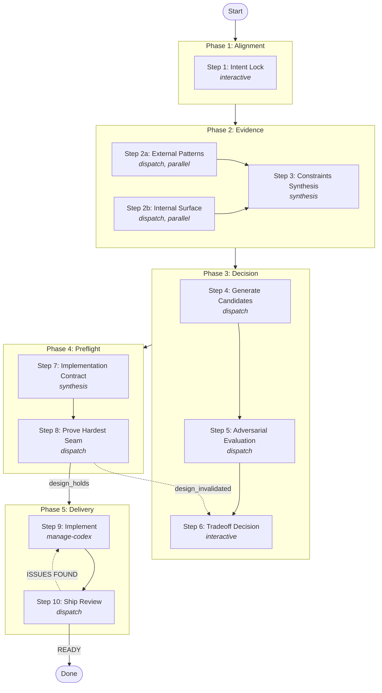

# Circuit for Claude Code

Structured workflow circuits for Claude Code -- disciplined multi-phase approaches to complex engineering tasks.

This plugin gives Claude Code nine reusable circuits for tackling complex software
engineering work. Each circuit is a multi-phase workflow that produces **artifact
chains** -- durable files that track progress and survive session restarts. Heavy
implementation work is dispatched to **Codex workers** for parallel execution,
while interactive steps keep you in control of key decisions. The result is
reliable, resumable engineering workflows that don't lose state when a session
ends or a context window fills up.

## What's Inside

| Circuit | Invoke | Best For |
|---------|--------|----------|
| Router | `/circuit:router` | Picking the right circuit when you're not sure which fits |
| Develop | `/circuit:develop` | Taking a feature from idea to shipped code |
| Decide | `/circuit:decide` | Architecture decisions under real uncertainty |
| Harden Spec | `/circuit:harden-spec` | Turning a rough RFC or PRD into something safe to build from |
| Repair Flow | `/circuit:repair-flow` | Debugging and repairing broken end-to-end flows |
| Ratchet Quality | `/circuit:ratchet-quality` | Overnight unattended quality improvement runs |
| Cleanup | `/circuit:cleanup` | Systematic dead code, stale docs, and codebase cleanup |
| Circuit Create | `/circuit:create` | Authoring a new circuit from a workflow description |
| Dry Run | `/circuit:dry-run` | Validating a circuit is mechanically sound before real use |
| Setup | `/circuit:setup` | Discover installed skills and generate circuit.config.yaml |

## Installation

### From GitHub (recommended)

```
claude plugin add petekp/circuit
```

### Local installation

```bash
git clone https://github.com/petekp/circuit.git ~/.claude/plugins/local/circuit
```

### Project setup

After installing, set up relay scripts in your project. These are the shell
scripts that circuits use to assemble Codex worker prompts and manage batch state.

```bash
# Use the setup helper (recommended)
"$(claude plugin path circuit)/scripts/setup.sh"

# Or copy relay scripts manually
cp -r "$(claude plugin path circuit)/scripts/relay" ./scripts/relay
```

### Prerequisites

- **Claude Code** -- the host environment
- **Codex CLI** -- `npm install -g @openai/codex` (dispatch engine for worker tasks)
- **Python 3** -- required by `update-batch.sh` for deterministic state management
- **AGENTS.md** -- create one in your project root so Codex workers understand your codebase conventions

### Verify installation

```bash
"$(claude plugin path circuit)/scripts/verify-install.sh"
```

The verification script checks for Codex CLI, Python 3, all skill directories,
relay script permissions, and runs a smoke test of the prompt composition
pipeline.

## Quick Start

Start with the router if you're not sure which circuit to use:

```
/circuit:router I need to add a recording and playback system that spans our Rust core and Swift app layers
```

Here's what happens:

1. **The router analyzes your task** and recommends the best circuit (or a
   sequence of circuits). In this case, it might suggest
   `decide` followed by `develop`.

2. **The circuit creates an artifact chain** in `.relay/circuit-runs/`. Each phase
   writes a durable file that feeds the next:
   `intent-brief.md` -> `external-digest.md` -> `options.md` -> `decision-packet.md` -> ...

3. **Interactive steps ask for your input** at decision points -- you set
   priorities, choose between options, and approve direction.

4. **Dispatch steps run Codex workers** for heavy lifting -- research,
   implementation, review, and convergence all happen in parallel worker
   processes.

5. **Resume awareness** means a fresh Claude Code session can pick up exactly
   where the last one stopped. The artifact chain is the state -- no chat
   history required.

## How Circuits Work

A circuit is defined by two files that work together: **`circuit.yaml`** declares
the topology (what phases and steps exist), and **`SKILL.md`** contains the full
execution contract (what actually happens at each step). When these two files
agree, the circuit is mechanically sound. When they drift, `/circuit:dry-run`
catches it.

### Anatomy of a circuit

Here's the topology of `develop` -- the circuit for taking a
feature from idea to shipped code:

```yaml
# circuit.yaml (simplified)
schema_version: "1"
circuit:
  id: develop
  phases:
    - id: alignment
      steps:
        - id: intent-lock
          action: interactive          # Claude interviews you
          produces: intent-brief.md
          gate:
            type: outputs_present
            checks: ["Ranked Outcomes non-empty"]

    - id: evidence
      steps:
        - id: evidence-probes
          action: dispatch             # Codex workers research in parallel
          execution: parallel
          workers:
            - id: external
              produces: external-digest.md
            - id: internal
              produces: internal-digest.md
        - id: constraints-synthesis
          action: synthesis            # Claude combines the evidence
          consumes: [external-digest.md, internal-digest.md]
          produces: constraints.md

    - id: decision
      steps:
        - id: generate-candidates
          action: dispatch
          produces: options.md
        - id: adversarial-evaluation
          action: dispatch
          produces: decision-packet.md
        - id: tradeoff-decision
          action: interactive          # You choose the direction
          produces: adr.md

    - id: preflight
      steps:
        - id: implementation-contract
          action: synthesis
          produces: execution-packet.md
        - id: prove-seam
          action: dispatch
          produces: seam-proof.md
          gate:
            type: evidence-reopen      # Can reopen if design breaks
            outcomes:
              design_holds: continue
              design_invalidated: interactive-reopen

    - id: delivery
      steps:
        - id: implement
          action: dispatch
          adapter: manage-codex        # Full implement/review/converge cycle
          produces: implementation-handoff.md
        - id: ship-review
          action: dispatch
          produces: ship-review.md
```

### The artifact chain

Every step produces a named file. Each file feeds the next step. This chain is
the durable state of the entire workflow:

```mermaid
graph LR
    A[intent-brief.md] --> B[external-digest.md]
    A --> C[internal-digest.md]
    B --> D[constraints.md]
    C --> D
    A --> E[options.md]
    D --> E
    D --> F[decision-packet.md]
    E --> F
    F --> G[adr.md]
    G --> H[execution-packet.md]
    D --> H
    A --> H
    H --> I[seam-proof.md]
    H --> J[implementation-handoff.md]
    H --> K[ship-review.md]
    J --> K
    A --> K

    style A fill:#2d4a22,stroke:#4a7c34
    style G fill:#2d4a22,stroke:#4a7c34
    style D fill:#1a3a4a,stroke:#2a6a8a
    style H fill:#1a3a4a,stroke:#2a6a8a
    style B fill:#4a3a1a,stroke:#8a6a2a
    style C fill:#4a3a1a,stroke:#8a6a2a
    style E fill:#4a3a1a,stroke:#8a6a2a
    style F fill:#4a3a1a,stroke:#8a6a2a
    style I fill:#4a3a1a,stroke:#8a6a2a
    style J fill:#4a3a1a,stroke:#8a6a2a
    style K fill:#4a3a1a,stroke:#8a6a2a
```



**Green** = interactive (you decide) · **Blue** = synthesis (Claude combines) · **Amber** = dispatch (Codex workers execute)

If a session dies at any point, a fresh session reads the artifacts on disk,
finds the last completed file, and resumes from the next step. No chat history
required.

### Three action types



| Action | Who does the work | When to use |
|--------|-------------------|-------------|
| **interactive** | You + Claude together | Alignment, priority setting, approval gates |
| **dispatch** | Codex worker (separate process) | Research, implementation, code review |
| **synthesis** | Claude alone | Combining evidence, scoring options, writing contracts |

### Quality gates

Every non-trivial step has a **gate** -- a quality check that must pass before
the circuit advances. Four gate types handle different situations:



| Gate | Purpose | Example |
|------|---------|---------|
| `outputs_present` | Artifact exists with required content | "constraints.md has at least one hard invariant" |
| `evidence-reopen` | Evidence can validate or invalidate the plan | Seam proof fails → reopen execution-packet |
| `verdict-reopen` | Review decides continue vs. revise | Ship review finds issues → reopen implementation |
| `verdict-consistency` | Terminal verdict must match evidence | Final audit contradicts evidence → escalate |

When a gate fails, the circuit doesn't silently continue -- it **reopens** the
relevant upstream step and re-derives everything downstream.

### The relay pipeline

Dispatch steps use two shell scripts to communicate with Codex workers:



- **`compose-prompt.sh`** assembles a worker prompt from a task-specific header,
  optional domain skills, and a template (implement, review, ship-review, converge)
- **`update-batch.sh`** manages batch state transitions deterministically --
  the orchestrator never hand-edits JSON

### Putting it all together

A complete circuit execution looks like this:



Solid arrows are the happy path. Dotted arrows are gate-driven reopens -- when
evidence disconfirms a downstream assumption, the circuit routes back to the
right upstream step instead of patching around the problem locally.

For the full design rationale, see [ARCHITECTURE.md](ARCHITECTURE.md).

## Domain Skills (Optional Companions)

Circuits can dispatch Codex workers with domain-specific skills injected into
their prompts via `compose-prompt.sh --skills`. These skills are **not bundled**
with the Circuit plugin -- install them separately if your project uses them.

| Skill | Enhances |
|-------|----------|
| `tdd` | repair-flow, ratchet-quality |
| `deep-research` | develop, decide |
| `clean-architecture` | ratchet-quality, decide |
| `swift-apps` | Any circuit working on Swift codebases |
| `rust` | Any circuit working on Rust codebases |

Domain skills are entirely optional. Circuits work without them -- workers just
receive less specialized guidance.

### Customizing Skills Per Circuit

Instead of passing `--skills` to every dispatch, you can create a
`circuit.config.yaml` that maps circuits to your preferred skills:

```yaml
# circuit.config.yaml (project root or ~/.claude/)
circuits:
  develop:
    skills: [tdd, deep-research]
  decide:
    skills: [architecture-exploration, solution-explorer]
  repair-flow:
    skills: [tdd]
  ratchet-quality:
    skills: [clean-architecture, tdd]
  cleanup:
    skills: [dead-code-sweep]
```

Generate this file automatically:

```
/circuit:setup
```

The setup skill discovers your installed skills, maps them to circuits, and
writes the config. See `circuit.config.example.yaml` for the full schema.

Config is optional -- explicit `--skills` flags always take precedence, and
everything works without a config file.

## File Structure

```
circuit/
  .claude-plugin/
    plugin.json               # Plugin manifest (name, version, metadata)
  hooks/
    hooks.json                # Hook registration (SessionStart banner)
    session-start.sh          # Prerequisite checks + available circuits table
  scripts/
    relay/
      compose-prompt.sh       # Assembles Codex worker prompts from parts
      update-batch.sh         # Deterministic batch state management
    setup.sh                  # Copies relay scripts into a target project
    verify-install.sh         # Checks all prerequisites and runs smoke tests
  skills/
    manage-codex/             # Batch orchestrator (implement/review/converge)
      SKILL.md
      references/             # Prompt templates for each worker role
    circuit-router/           # Routes tasks to the best circuit
      SKILL.md
    circuit-develop/
      circuit.yaml            # Topology: phases, steps, artifacts, gates
      SKILL.md                # Execution contract: commands, resume logic
    circuit-decide/
      circuit.yaml
      SKILL.md
    circuit-harden-spec/
      circuit.yaml
      SKILL.md
    circuit-repair-flow/
      circuit.yaml
      SKILL.md
    circuit-ratchet-quality/
      circuit.yaml
      SKILL.md
    circuit-cleanup/
      circuit.yaml
      SKILL.md
    circuit-create/           # Meta-circuit: authors new circuits
      circuit.yaml
      SKILL.md
    circuit-dry-run/          # Validates circuit mechanical soundness
      circuit.yaml
      SKILL.md
    circuit-setup/            # Skill discovery and config generation
      SKILL.md
  circuit.config.example.yaml # Example config for skill customization
  ARCHITECTURE.md             # Deep dive into system design
  CIRCUITS.md                 # Detailed catalog of all circuits with examples
  LICENSE                     # MIT
```

Each circuit skill has two files: `circuit.yaml` declares the topology (phases,
steps, artifacts, gates) and `SKILL.md` contains the full execution contract.
When these two files agree, the circuit is mechanically sound. When they drift,
`circuit:dry-run` catches it.

## Further Reading

- **[CIRCUITS.md](CIRCUITS.md)** -- detailed catalog of all nine circuits with
  phase breakdowns, artifact chains, and concrete usage examples
- **[ARCHITECTURE.md](ARCHITECTURE.md)** -- deep dive into the system design:
  artifact chain model, execution model, gate system, relay infrastructure,
  circuit composition, and extension guide

## Contributing

Contributions are welcome. The plugin includes built-in tools for extending
itself:

- **`/circuit:create`** -- author a new circuit from a natural-language
  workflow description. It interviews you about the workflow shape, generates
  both `circuit.yaml` and `SKILL.md`, cross-validates them, and installs the
  result.
- **`/circuit:dry-run`** -- validate that a circuit is mechanically sound before
  using it for real work. Simulates every step, checks artifact chain closure,
  gate validity, and template compliance.

When submitting a new circuit, run `dry-run` against it and include the
`dry-run-trace.md` output in your PR.

## License

MIT
