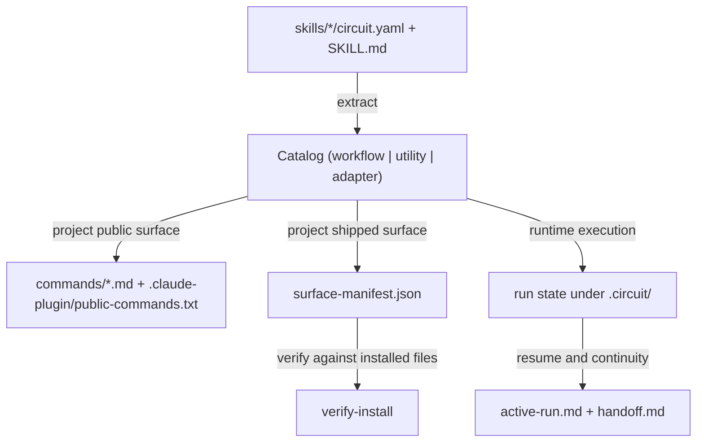
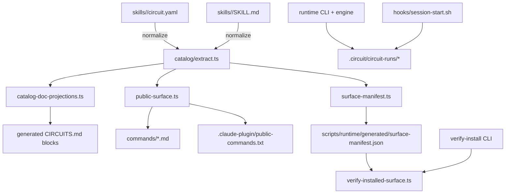
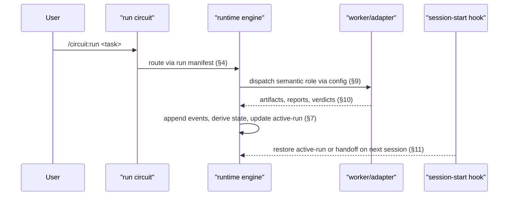
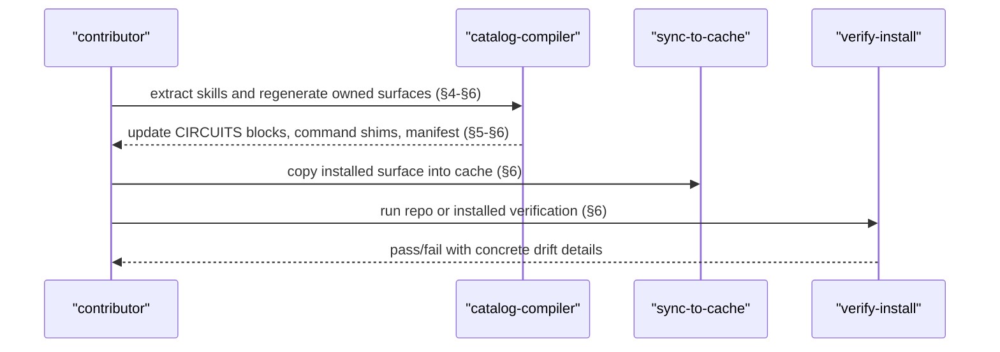

# Circuit: A Literate Guide

> *A narrative walkthrough of Circuit as it exists today: a workflow engine, a compile-oriented catalog compiler, and a shipped-plugin verifier that now agrees with its own generator. This guide is ordered for understanding rather than file layout. Cross-references using the `§` symbol connect the same ideas from different angles.*

---

## §1. The Problem

Circuit exists because "use an agent to do the thing" is not, by itself, a durable workflow. A useful automation layer for Claude Code has to survive `/clear`, survive a crashed session, survive stale generated files, and survive the drift that appears when a project has both handwritten docs and machine-generated command surfaces.

The codebase has gradually moved toward a stronger answer to that problem. The older shape of the system relied on a mixture of skill files, generated docs, shell wrappers, and broad integrity checks. The current shape is more deliberate: skills are normalized into a typed catalog, public command surfaces are derived instead of restated, shipped files are inventoried into a manifest, and install verification checks the actual filesystem rather than trusting a document to be true. The most recent control-plane passes on this branch finished tightening that loop by making repo-time surface generation fail closed on missing required seed paths, so generation and verification now agree (§6).

That tells us the real thesis of Circuit: durable automation is not a prompt. It is a contract between authored workflow definitions, a runtime that records what happened, and a compiler/verifier pair that proves the plugin surface still matches the contract.

With that problem statement in place, we can name the domain objects that make the rest of the code readable in §2.

---

## §2. The Domain

Circuit's vocabulary is compact, but each word carries real architectural weight:

- A **workflow** is a public circuit with a `circuit.yaml` manifest and a `SKILL.md` execution contract.
- A **utility** is public but non-workflow, such as `review` or `handoff`.
- An **adapter** is shipped but internal. The most important one is `workers`, which exists to orchestrate long-running implement-review-converge loops without becoming a public slash command (§10).
- A **run** is a single execution rooted under `.circuit/circuit-runs/<slug>`.
- An **artifact** is the durable output of a step. Circuit treats artifacts as state, not chat history (§7).
- The **catalog** is the normalized list of entries derived from `skills/*`.
- The **surface manifest** is the inventory of files the plugin is expected to ship (§6).



Two boundaries matter immediately.

First, workflow identity and execution are not the same thing. `skills/build/circuit.yaml` says what the Build graph is; `skills/build/SKILL.md` says how the orchestrator should behave while executing that graph. Second, public visibility is not a naming convention; it is a role decision enforced by the catalog/compiler path. That distinction matters throughout §4, §5, and §6.

Now that we have the vocabulary, we can stand back and look at the whole machine.

---

## §3. The Shape of the System

Circuit is easiest to understand as three cooperating subsystems:

1. The **authored workflow layer** under `skills/`, where humans define workflow topology and execution contracts.
2. The **runtime engine** under `scripts/runtime/engine/src/`, which validates manifests, derives state from events, resolves resume points, and dispatches workers.
3. The **control plane** under `scripts/runtime/engine/src/catalog/`, which turns authored skills into generated reference blocks, public command surfaces, and a verifiable shipped-file contract.



The biggest architectural change since `origin/main` is that this control plane is now much more explicit. Recent commits on the current branch converged generation, ownership, and verification around split owners:

- extraction in `extract.ts`
- generated `CIRCUITS.md` block projection in `catalog-doc-projections.ts`
- public projection in `public-surface.ts`
- target registration in `generate-targets.ts`
- shipped-root policy in `surface-roots.ts`
- raw filesystem collection in `surface-fs.ts`
- repo-time inventory projection in `surface-inventory.ts`
- manifest-vs-filesystem verification in `verify-installed-surface.ts`

That split is not bureaucracy. It is how Circuit avoids the classic drift where the docs say one thing, the generated commands say another, and the install verifier quietly checks a third. The rest of this guide is really just a tour of those boundaries.

We begin where Circuit itself begins: with authored skills becoming a typed catalog in §4.

---

## §4. Skills Become a Catalog

The extractor is where authored text becomes machine-readable contract. It reads each skill directory, insists on a well-formed `SKILL.md` frontmatter block, treats the presence of `circuit.yaml` as the definition of "workflow", and forces everything else to declare `role: utility|adapter`.

Excerpt: `scripts/runtime/engine/src/catalog/extract.ts:137-229`

```ts
for (const dir of readDir(skillsDir).sort()) {
  const skillMdPath = `${skillsDir}/${dir}/SKILL.md`;
  const circuitYamlPath = `${skillsDir}/${dir}/circuit.yaml`;

  const frontmatter = parseFrontmatter(readFile(skillMdPath), skillMdPath);
  const skillName = getRequiredFrontmatterString(frontmatter, "name", skillMdPath);
  const skillDescription = getRequiredFrontmatterString(frontmatter, "description", skillMdPath);

  if (skillName !== dir) {
    throw new Error(
      `catalog-compiler: ${skillMdPath} -- frontmatter name="${skillName}" must match directory "${dir}"`,
    );
  }

  if (!exists(circuitYamlPath)) {
    const role = getOptionalFrontmatterRole(frontmatter, skillMdPath);
    if (!role) {
      throw new Error(
        `catalog-compiler: ${skillMdPath} -- non-workflow skills must declare frontmatter role: utility|adapter`,
      );
    }

    const entry: UtilityEntry | AdapterEntry = {
      dir,
      kind: role,
      skillDescription,
      skillName,
      slug: dir,
    };
    entries.push(entry);
    continue;
  }

  const role = getOptionalFrontmatterRole(frontmatter, skillMdPath);
  if (role) {
    throw new Error(
      `catalog-compiler: ${skillMdPath} -- workflow skills must not declare frontmatter "role"`,
    );
  }
  // ...
}
```

Three decisions in this file define the current architecture.

First, workflow-ness is inferred from `circuit.yaml`, not declared redundantly. That keeps runtime identity in one place and is a direct expression of the ownership rule later documented in `docs/control-plane-ownership.md`. Second, the extractor explicitly forbids legacy `entry.command` and `expert_command` fields and permits only `entry.usage` as a placeholder suffix. That keeps slash identity derived from the slug instead of smuggled into manifests by hand. Third, adapters and utilities are separate kinds now; `workers` is therefore modeled as internal plumbing rather than a public lifecycle utility, which pays off in §5 and §10.

The `run` workflow is a small but important example of the new model. Its manifest is intentionally tiny because its job is routing, not doing:

Excerpt: `skills/run/circuit.yaml:1-37`

```yaml
schema_version: "2"
circuit:
  id: run
  version: "2026-04-04"
  purpose: >
    Lightweight router. Classifies tasks into one of five workflows
    (Explore, Build, Repair, Migrate, Sweep), selects a rigor profile,
    and dispatches.

  entry:
    usage: <task>
    signals:
      include: [any_task]
      exclude: []
```

By the time `extract.ts` returns, Circuit has a stable catalog of workflows, utilities, and adapters. That catalog is the only thing later generators are allowed to consume. Once you understand that, the public command surface in §5 feels inevitable rather than magical.

---

## §5. Public Commands Are Projected, Not Handwritten

Circuit's public slash surface is no longer a loose collection of markdown files. It is projected from catalog entries and only from catalog entries. The projection code makes that policy explicit: workflows and utilities are public, adapters are not.

Excerpt: `scripts/runtime/engine/src/catalog/public-surface.ts:46-95`

```ts
export function isPublicEntry(entry: CircuitIR): entry is WorkflowEntry | UtilityEntry {
  return entry.kind === "workflow" || entry.kind === "utility";
}

export function getPublicEntries(catalog: Catalog): Array<WorkflowEntry | UtilityEntry> {
  return catalog.filter(isPublicEntry).sort(compareEntriesBySlug);
}

export function getPublicCommandInvocation(entry: WorkflowEntry | UtilityEntry): string {
  if (entry.kind === "workflow" && entry.entryUsage) {
    return `${getSlashCommand(entry)} ${entry.entryUsage}`;
  }

  return getSlashCommand(entry);
}

export function renderCommandShim(entry: WorkflowEntry | UtilityEntry): string {
  const description = firstSentence(entry.skillDescription);
  return [
    "---",
    `description: "${escapeYamlDoubleQuotedString(description)}"`,
    "---",
    "",
    `Use the circuit:${entry.slug} skill to handle this request.`,
    "",
  ].join("\n");
}
```

This is a subtle but major shift from the older repo state. The command shims under `commands/` are no longer a place where public identity can drift. They are an output. That is why `workers` no longer leaks out as a public command even though it still ships as a skill (§10).

The next layer, `generate-targets.ts`, makes the compiler path concrete by registering the exact files the catalog compiler is allowed to write:

Excerpt: `scripts/runtime/engine/src/catalog/generate-targets.ts:20-40`

```ts
function getSurfaceFileTargets(repoRoot: string, catalog: Catalog): FileGenerateTarget[] {
  const commandTargets: FileGenerateTarget[] = getPublicEntries(catalog).map((entry) => ({
    filePath: resolve(repoRoot, "commands", `${entry.slug}.md`),
    render: () => renderCommandShim(entry),
  }));

  return [
    {
      filePath: resolve(repoRoot, ".claude-plugin", "public-commands.txt"),
      render: renderPublicCommandsFile,
    },
    ...commandTargets,
    {
      filePath: resolve(repoRoot, SURFACE_MANIFEST_PATH),
      render: (entries) => renderSurfaceManifest(repoRoot, entries),
    },
  ];
}
```

That generated surface is a little broader than command shims. The catalog compiler also owns the machine-written blocks inside `CIRCUITS.md`, and it does so through a separate projection module rather than mixing doc-block rendering into slash-command generation.

Excerpt: `scripts/runtime/engine/src/catalog/catalog-doc-projections.ts:58-75`

```ts
export function getCatalogDocTargets(repoRoot: string): BlockGenerateTarget[] {
  return [
    {
      blockName: "CIRCUIT_TABLE",
      filePath: resolve(repoRoot, "CIRCUITS.md"),
      render: renderCircuitTable,
    },
    {
      blockName: "UTILITY_TABLE",
      filePath: resolve(repoRoot, "CIRCUITS.md"),
      render: renderUtilityTable,
    },
    {
      blockName: "ENTRY_MODES",
      filePath: resolve(repoRoot, "CIRCUITS.md"),
      render: renderEntryModes,
    },
  ];
}
```

That split is worth noticing. `CIRCUITS.md` is hybrid: a handwritten narrative shell with machine-owned marker blocks. `README.md`, `ARCHITECTURE.md`, and the rest of the long-form guidance docs remain fully handwritten. The compile-oriented RFC argued for exactly this kind of narrow compiler: own the mechanical restatements, leave explanatory prose human-owned. This literate guide depends on that choice; it would be far less trustworthy if it were itself a generated restatement of code facts.

Once the public surface is projected, the next question is harder: what does Circuit claim to ship, and how does it prove that claim? That is §6.

---

## §6. The Shipped Surface Is Now a Contract

The control-plane convergence work is most visible in the shipped-surface path. What used to be a broader, more entangled "surfaces" concept is now a set of named owners with one job each.

`surface-roots.ts` owns the allowed roots and the repo-only seed paths used to inventory the future install:

Excerpt: `scripts/runtime/engine/src/catalog/surface-roots.ts:8-66`

```ts
export const INSTALLED_SURFACE_ROOTS = [
  ".claude-plugin",
  "commands",
  "hooks",
  "schemas",
  "scripts",
  "skills",
  "circuit.config.example.yaml",
] as const;

const REPO_INSTALLED_SCRIPT_PATHS = [
  "scripts/sync-to-cache.sh",
  "scripts/verify-install.sh",
  "scripts/relay",
  "scripts/runtime/bin",
  "scripts/runtime/generated",
] as const;

export function listInstalledSurfaceSeedPaths(mode: InstalledSurfaceMode): readonly string[] {
  if (mode === "installed") {
    return listInstalledSurfaceRoots();
  }

  return [
    ...INSTALLED_SURFACE_ROOTS.filter((root) => root !== "scripts"),
    ...REPO_INSTALLED_SCRIPT_PATHS,
  ];
}
```

`surface-inventory.ts` then turns those seed paths into a repo-time inventory and, as of the latest hardening pass, refuses to continue if any required repo seed path is missing:

Excerpt: `scripts/runtime/engine/src/catalog/surface-inventory.ts:28-49`

```ts
function assertNoMissingRepoSeedPaths(missingSeedPaths: readonly string[]): void {
  if (missingSeedPaths.length === 0) {
    return;
  }

  throw new Error(
    `catalog-compiler: missing repo installed-surface seed path(s): ${
      [...missingSeedPaths].sort().join(", ")
    }`,
  );
}

function listInstalledFiles(repoRoot: string): string[] {
  const result = collectSurfaceFiles({
    ignoreRelativePath: shouldIgnoreInstalledPath,
    rootDir: repoRoot,
    seedPaths: listInstalledSurfaceSeedPaths("repo"),
  });

  assertNoMissingRepoSeedPaths(result.missingSeedPaths);
  return result.files;
}
```

That one check captures the newest architectural change on the branch. The verifier had already been treating missing seed paths as errors; generation was still quietly taking `result.files` and moving on. The current state closes that disagreement. Repo-time generation and install-time verification now share the same invariant: missing required seeds are a hard failure, not an invitation to build a partial truth.

The verifier itself stays narrow. It checks the actual installed filesystem against the manifest, validates top-level installed roots, and preserves the same public-vs-internal distinctions enforced earlier in the compiler:

Excerpt: `scripts/runtime/engine/src/catalog/verify-installed-surface.ts:34-53`

```ts
function collectActualFiles(
  pluginRoot: string,
  mode: InstalledSurfaceMode,
  errors: string[],
): string[] {
  const result = collectSurfaceFiles({
    ignoreRelativePath: shouldIgnoreInstalledPath,
    rootDir: pluginRoot,
    seedPaths: listInstalledSurfaceSeedPaths(mode),
  });

  for (const relativePath of result.missingSeedPaths) {
    errors.push(
      mode === "installed"
        ? `missing shipped root ${relativePath}`
        : `missing shipped path ${relativePath}`,
    );
  }

  return result.files;
}
```

The broader install diagnostic is intentionally one layer up. `verify-installed-surface.ts` is narrow by design, while the CLI in `scripts/runtime/engine/src/cli/verify-install.ts` orchestrates the wider contributor story: generated freshness in repo mode, shipped-surface agreement, config discovery behavior, dispatch contract checks, and bundled runtime round trips.

Excerpt: `scripts/runtime/engine/src/cli/verify-install.ts:139-176`

```ts
function verifyGeneratedFreshness(
  reporter: Reporter,
  pluginRoot: string,
  mode: InstalledSurfaceMode,
): void {
  if (mode !== "repo") {
    return;
  }

  reporter.section("Generated freshness");
  const cliPath = resolve(pluginRoot, "scripts/runtime/bin/catalog-compiler.js");
  const result = runNodeCli(cliPath, ["generate", "--check"], { cwd: pluginRoot });
  // ...
}

function verifySurface(
  reporter: Reporter,
  pluginRoot: string,
  mode: InstalledSurfaceMode,
): void {
  reporter.section("Shipped surface");
  const result = verifyInstalledSurface({ mode, pluginRoot });
  // ...
}
```

One consequence of the recent convergence work is that cache sync, manifest generation, and install verification are now all speaking about the same installed surface. `surface-roots.ts` names it, `surface-inventory.ts` projects it, `sync-to-cache.sh` copies it, and `verify-install` proves it. This split is one of the best examples of Circuit's recent maturation. `surface-roots.ts` owns the list, `surface-fs.ts` owns walking and hashing, `surface-inventory.ts` owns repo-time projection, and `verify-installed-surface.ts` owns agreement checking. No layer needs to be clever because each one knows exactly which fact is its responsibility. That same philosophy reappears inside run execution in §7.

---

## §7. Execution Is an Event-Sourced Artifact Chain

The runtime engine does not treat the chat thread as the source of truth. It treats the run directory as the source of truth. `derive-state.ts` replays `events.ndjson` into `state.json`, and the projection is explicit enough that you can read it as a state machine rather than as incidental bookkeeping.

Excerpt: `scripts/runtime/engine/src/derive-state.ts:61-149`

```ts
export function deriveState(
  manifest: Record<string, unknown>,
  events: Record<string, unknown>[],
): Record<string, unknown> {
  const circuit = (manifest.circuit ?? {}) as Record<string, unknown>;
  const circuitId = (circuit.id ?? "") as string;
  const manifestVersion = (circuit.version ?? "") as string;

  const state: Record<string, unknown> = {
    schema_version: "1",
    run_id: "",
    circuit_id: circuitId,
    manifest_version: manifestVersion,
    status: "initialized",
    current_step: null,
    selected_entry_mode: "default",
    git: { head_at_start: "0000000" },
    artifacts: {} as Record<string, Record<string, unknown>>,
    jobs: {} as Record<string, Record<string, unknown>>,
    checkpoints: {} as Record<string, Record<string, unknown>>,
    routes: {} as Record<string, string>,
  };

  for (const event of events) {
    const eventType = (event.event_type ?? "") as string;
    const payload = (event.payload ?? {}) as Record<string, unknown>;
    // ...
  }
}
```

The important design choice is not merely "we record events." It is that steps become complete only when their outputs have been gated and routed. Artifacts, jobs, checkpoints, and routes are separate maps because they answer separate questions: what was produced, what was dispatched, what is waiting on the user, and where does the graph go next? That distinction is what allows Build, Repair, Migrate, and Sweep to share one runtime without pretending they are the same workflow (§2, §12).

The Build manifest shows how that abstract runtime contract feels from a workflow author's point of view:

Excerpt: `skills/build/circuit.yaml:27-144`

```yaml
steps:
  - id: frame
    executor: orchestrator
    kind: checkpoint
    writes:
      artifact:
        path: artifacts/brief.md
        schema: brief@v1
      request: checkpoints/{step_id}-{attempt}.request.json
      response: checkpoints/{step_id}-{attempt}.response.json
    routes:
      continue: plan

  - id: act
    executor: worker
    kind: dispatch
    writes:
      artifact:
        path: artifacts/implementation-handoff.md
        schema: implementation-handoff@v1
      request: jobs/{step_id}-{attempt}.request.json
      receipt: jobs/{step_id}-{attempt}.receipt.json
      result: jobs/{step_id}-{attempt}.result.json
    routes:
      pass: verify
```

In other words, the runtime is generic, but it is not vague. A circuit author declares exactly which files appear, which gates validate them, and which route follows a pass. That gives Circuit resumability without mystery. Which brings us directly to §8.

---

## §8. Resume Trusts Replay More Than Stale State

Resume is conservative in the right direction. It assumes that if `events.ndjson` is newer than `state.json`, the projection must be rebuilt before anyone trusts the current state. That is the runtime equivalent of the fail-closed generator behavior we saw in §6.

Excerpt: `scripts/runtime/engine/src/resume.ts:39-80`

```ts
export function loadOrRebuildState(runRoot: string): object {
  const statePath = join(runRoot, "state.json");
  const eventsPath = join(runRoot, "events.ndjson");

  let needsRebuild = false;

  if (!existsSync(statePath)) {
    needsRebuild = true;
  } else if (existsSync(eventsPath)) {
    const stateMtime = statSync(statePath).mtimeMs;
    const eventsMtime = statSync(eventsPath).mtimeMs;
    if (eventsMtime > stateMtime) {
      needsRebuild = true;
    }
  }

  if (needsRebuild) {
    const manifest = loadManifest(runRoot) as Record<string, unknown>;
    const events = loadEvents(runRoot);
    const state = deriveState(manifest, events);
    // validate, write, return
  }
  // otherwise parse and validate existing state.json
}
```

Later in the same file, `findResumePoint` walks the manifest graph and the recorded routes to find the first incomplete step rather than naively rerunning from the beginning. That means Circuit is not resumable merely because it has files on disk; it is resumable because replay and graph traversal agree on what "done" means.

This is one of the places where the codebase feels most opinionated in a good way. Circuit would rather rebuild and validate than optimistically trust stale state. The same stance shows up again in dispatch routing: semantic intent comes first, transport comes second.

That transport model is §9.

---

## §9. Dispatch Is Semantic; Adapters Are Just Transports

One of the cleaner architectural choices in modern Circuit is that manifests do not encode transport. A workflow asks for a reviewer or implementer; the runtime decides whether that means Claude Code Agent, Codex CLI, or a custom wrapper executable defined in `circuit.config.yaml`.

Excerpt: `scripts/runtime/engine/src/dispatch.ts:185-248`

```ts
function resolveDispatchAdapter(
  config: Record<string, unknown>,
  options: Pick<DispatchTaskOptions, "adapterOverride" | "circuit" | "role">,
  configPath?: string | null,
): DispatchResolution {
  const dispatch = loadDispatchConfig(config);
  const role = normalizeRole(options.role);

  let selected = options.adapterOverride;
  let resolvedFrom = "override";

  if (!selected) {
    if (role && dispatch.roles[role]) {
      selected = dispatch.roles[role];
      resolvedFrom = `dispatch.roles.${role}`;
    } else if (options.circuit && dispatch.circuits[options.circuit]) {
      selected = dispatch.circuits[options.circuit];
      resolvedFrom = `dispatch.circuits.${options.circuit}`;
    } else if (dispatch.defaultAdapter) {
      selected = dispatch.defaultAdapter;
      resolvedFrom = "dispatch.default";
    } else {
      selected = "auto";
      resolvedFrom = "auto";
    }
  }
  // agent, codex, or configured process adapter
}
```

`config.ts` supports that model by discovering configuration in a very specific order: explicit file, then nearest repo config walking upward to the git root, then `~/.claude/circuit.config.yaml`.

Excerpt: `scripts/runtime/engine/src/config.ts:67-137`

```ts
export function discoverConfigPaths(options: LoadCircuitConfigOptions = {}): string[] {
  const paths: string[] = [];
  const cwd = options.cwd ?? process.cwd();
  // walk upward to git root, then append ~/.claude fallback
}

export function loadCircuitConfig(
  options: LoadCircuitConfigOptions = {},
): LoadedCircuitConfig {
  if (options.configPath) {
    return { config: parseConfigFile(options.configPath), path: options.configPath };
  }

  for (const candidate of discoverConfigPaths(options)) {
    if (!existsSync(candidate)) {
      continue;
    }
    return { config: parseConfigFile(candidate), path: candidate };
  }

  return { config: {}, path: null };
}
```

This is a more important design choice than it first appears. Because transport selection is semantic, the same Build or Migrate workflow can run against different execution backends without mutating the workflow manifests themselves. That keeps authored workflow logic stable and pushes environment-specific concerns outward to config. It also makes the `workers` adapter in §10 possible: workers can behave like an internal orchestration primitive without becoming a distinct public workflow language.

---

## §10. Workers Are an Internal Adapter, Not a Public Workflow

The `workers` skill is the clearest statement of Circuit's internal/public separation. It ships, it is essential, and it is intentionally not public. In the current architecture, it is an adapter that orchestrates a bounded implement-review-converge loop.

Excerpt: `skills/workers/SKILL.md:1-48`

```md
---
name: workers
description: >
  Internal adapter for worker orchestration.
role: adapter
---

Loop:
- `plan -> implement -> review -> converge`
- `review reject -> re-implement -> re-review`

Done only when the convergence worker says `COMPLETE AND HARDENED`.
```

Later sections of the same skill define the rules that make the loop trustworthy:

Excerpt: `skills/workers/SKILL.md:56-133`

```md
- one record per slice: `id`, `type`, `task`, `file_scope`, `domain_skills`,
  `verification_commands`, `success_criteria`, `status`, `impl_attempts`,
  `review_rejections`

1. Compose the prompt and dispatch
2. Verify output exists
3. Spot-check one critical claimed command
4. Review in a separate session
5. Converge only when all non-converge slices are done
6. Loop on `ISSUES REMAIN`
```

This is where Circuit stops being "a set of prompts" and becomes an operating model. Reviews are separate sessions. Convergence is diagnose-only. The orchestrator owns `batch.json`. Workers never edit that file. These are organizational boundaries expressed as artifact rules.

The relay prompt builder exists to keep that orchestration deterministic. `compose-prompt.sh` assembles task-specific headers, selected domain skills, and relay templates, then fails if unresolved placeholders remain outside fenced code blocks:

Excerpt: `scripts/relay/compose-prompt.sh:31-109`

```bash
SKILL_DIRS=()
if [[ -n "${CIRCUIT_PLUGIN_SKILL_DIR:-}" ]]; then
  SKILL_DIRS+=("$CIRCUIT_PLUGIN_SKILL_DIR")
fi
SKILL_DIRS+=("$HOME/.claude/skills")

apply_relay_root_substitution() {
  local out_file="$1"
  local relay_root="$2"
  # substitute {relay_root} deterministically
}
```

The guiding idea here is the same as in §6 and §8: do not improvise over ambiguity. Assemble the prompt from known parts, substitute known placeholders, and abort if the final instruction set still contains unresolved tokens. It is the same fail-closed instinct, just aimed at orchestration rather than at install verification.

That same instinct shapes continuity on session start, which is §11.

---

## §11. Continuity Survives `/clear`

Circuit uses two continuity mechanisms on purpose, not by historical accident. `active-run.md` is the automatic dashboard; `handoff.md` is the intentional high-fidelity snapshot. The session-start hook prefers a pending handoff, falls back to the explicitly pointed active run, and only then falls back to the most recent `active-run.md`.

Excerpt: `hooks/session-start.sh:15-52`

```bash
active_run=""
circuit_runs_dir="${project_dir}/.circuit/circuit-runs"
current_run_pointer="${project_dir}/.circuit/current-run"

if [[ -L "$current_run_pointer" ]] || [[ -f "$current_run_pointer" ]]; then
  # resolve explicit current run pointer
fi

if [[ -z "$active_run" ]] && [[ -d "$circuit_runs_dir" ]]; then
  newest_mtime=0
  newest_file=""
  while IFS= read -r -d '' candidate; do
    if mtime=$(stat -f %m "$candidate" 2>/dev/null) || mtime=$(stat -c %Y "$candidate" 2>/dev/null); then
      if (( mtime > newest_mtime )); then
        newest_file="$candidate"
      fi
    fi
  done < <(find "$circuit_runs_dir" -name "active-run.md" -maxdepth 3 -type f -print0 2>/dev/null)
  [[ -n "$newest_file" ]] && active_run="$newest_file"
fi
```

This layered lookup strategy matters because `/clear` is not exceptional in Circuit's world. It is part of normal operation. The hook is therefore not a convenience flourish; it is part of the runtime contract. The handoff utility's prose says as much, but the hook is where the promise becomes real.

At this point we have enough pieces to trace one concrete end-to-end flow.

---

## §12. How It All Fits Together

Two different flows matter in day-to-day Circuit work, and it is better to separate them than to pretend they are one giant pipeline.

The first is the **runtime path**: a user invokes a circuit and the engine executes it.



The second is the **maintenance path**: a contributor changes skills or runtime code, regenerates compiler-owned surfaces, syncs the shipped install surface, and verifies that the install still matches the contract.



Keeping those flows separate makes the architecture easier to trust.

The first important consequence is that `/circuit:run` is just another authored workflow, not a privileged hardcoded command. Its routing behavior lives in `skills/run/circuit.yaml` (§4). The second is that Build, Repair, Explore, Migrate, and Sweep do not each implement their own runtime. They share the same event log, resume logic, config discovery, and dispatch machinery (§7-§9). The third is that the control plane is not on the user hot path. It is a contributor-facing maintenance path that regenerates machine-owned surfaces and proves the installed plugin still matches them (§5-§6).

That is why the recent convergence work matters: it reduces the number of places where Circuit can accidentally become two different systems at once.

The remaining question is where the seams still are. That is §13.

---

## §13. The Edges

The most interesting edge behavior in modern Circuit is not in happy-path execution. It is in the ways the system refuses to trust stale, partial, or ownerless state.

- `extract.ts` throws on malformed frontmatter, mismatched names, illegal role declarations, and forbidden entry fields (§4).
- `generate.ts` refuses to patch marker blocks if the begin/end markers are malformed, rather than silently skipping drift (§5).
- `surface-inventory.ts` now throws if required repo seed paths are missing, which prevents partial manifests from being generated (§6).
- `verify-installed-surface.ts` treats missing shipped paths, unexpected top-level roots, hash drift, and executable-bit drift as concrete errors (§6).
- `resume.ts` rebuilds state when events are newer than `state.json` and validates the result against schema before returning it (§8).
- `dispatch.ts` rejects unsupported roles and removed legacy config keys instead of trying to infer intent (§9).
- `compose-prompt.sh` aborts when unresolved placeholders remain in a worker prompt (§10).

In other words, the codebase's recent architectural changes are not mostly about new features. They are about sharper refusal modes. Circuit now has a much stronger bias toward "stop with a precise complaint" than toward "continue with an incomplete model." That is exactly the right bias for a plugin whose job is to automate other work without introducing silent drift.

Those refusal modes are also why the handwritten docs can remain handwritten. Mechanical truth has named owners and tests. Narrative docs like this guide, `README.md`, and `ARCHITECTURE.md` are free to explain the system instead of pretending to be a second compiler.

That leaves one final question: where does Circuit want to evolve from here?

---

## §14. Looking Forward

The current architecture leaves Circuit in a good place because its extension points are now clearer than they were a few commits ago.

If we add a new workflow, we do it by authoring `skills/<slug>/circuit.yaml` and `SKILL.md`, then letting extraction and generation absorb it (§4-§5). If we add a new generated surface, we should add it through the existing catalog compiler path and name an owner as explicitly as the current control-plane modules do (§3, §6). If we change the shipped install shape, we should be able to point to the exact owner file and the exact verifier that proves the change (§6). And if we expand transports, the right place is dispatch config and dispatch resolution, not the workflow manifests (§9).

The healthiest constraint in the current codebase is that it no longer tolerates ownerless facts well. That can feel rigid in the moment, but it is the reason the repo's latest state is easier to trust. Circuit still does something ambitious: it tries to turn agentic work into a resumable, reviewable, verifiable process. What has changed recently is that more of that ambition is now encoded as contracts instead of custom and hope.

That is the latest state of the system. The code reads more cleanly because the architecture has become less accidental.

---

*§-index: §1 The Problem; §2 The Domain; §3 The Shape of the System; §4 Skills Become a Catalog; §5 Public Commands Are Projected, Not Handwritten; §6 The Shipped Surface Is Now a Contract; §7 Execution Is an Event-Sourced Artifact Chain; §8 Resume Trusts Replay More Than Stale State; §9 Dispatch Is Semantic; Adapters Are Just Transports; §10 Workers Are an Internal Adapter, Not a Public Workflow; §11 Continuity Survives `/clear`; §12 How It All Fits Together; §13 The Edges; §14 Looking Forward*
