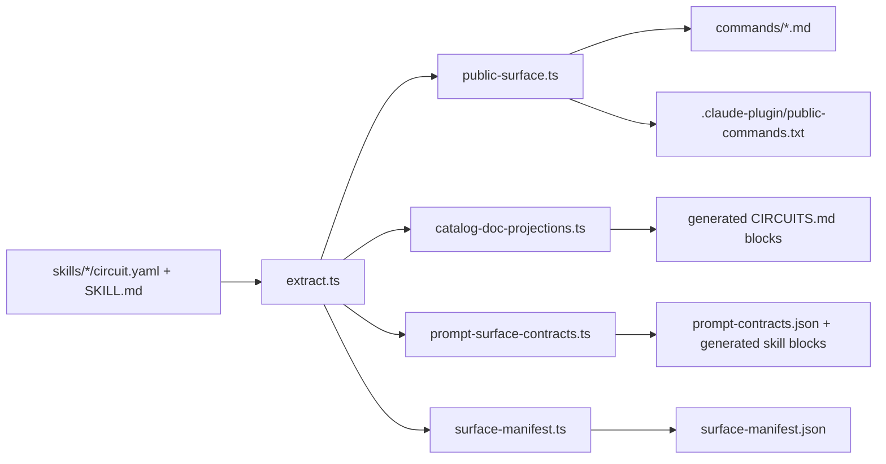

# Circuit: A Literate Guide

This guide explains how Circuit works today by following the facts the code
actually owns. It is not the schema reference, and it is not the generated
catalog. It is the narrative layer: the document we would hand to a strong new
maintainer so they can form the right mental model before they start changing
things.

For the concise reference, read [ARCHITECTURE.md](../ARCHITECTURE.md). For the
ownership map, read
[docs/control-plane-ownership.md](control-plane-ownership.md). For the
generated catalog and public workflow list, read [CIRCUITS.md](../CIRCUITS.md).

## §1. The Job Circuit Is Really Doing

Circuit exists because "tell the coding agent what to do" is not enough on its
own. A useful workflow system has to answer three harder questions:

1. What are the workflows, really?
2. What public surface does the plugin actually ship?
3. If a run gets interrupted, what state survives and how do we continue it?

Those questions sound related, but Circuit answers them with different kinds of
artifacts owned by different parts of the codebase. That separation is the main
idea to carry through the whole repository.

Circuit is therefore not one thing. It is three cooperating layers:

- an authored workflow layer under `skills/`
- a compiler-style control plane under
  `scripts/runtime/engine/src/catalog/`
- a runtime and continuity layer under
  `scripts/runtime/engine/src/`

Once we keep those layers separate, the repo stops feeling like a collection of
plugin tricks and starts reading like a system with clear boundaries.

## §2. The Three Records Circuit Refuses To Confuse

The cleanest way to understand Circuit is to notice that it keeps three records
of reality and does not let any one of them impersonate the others.

| Record | Owned by | Primary files | Purpose |
|---|---|---|---|
| Authored workflow identity | skill authors | `skills/<slug>/circuit.yaml`, `skills/<slug>/SKILL.md` | Define what a workflow, utility, or adapter is |
| Generated shipped surface | catalog/control-plane compiler | `commands/*.md`, `.claude-plugin/public-commands.txt`, `scripts/runtime/generated/*.json` | Project authored facts and control-plane contracts into the installed plugin surface |
| Runtime and continuity state | engine runtime | `.circuit/circuit-runs/*`, `.circuit/control-plane/*` | Record what a live run did and what a future session should resume |

That split is load-bearing.

Narrative docs do not own runtime identity. Generated command shims do not own
workflow design. `state.json` does not own history. Circuit stays trustworthy
because each layer is narrow about what it is allowed to assert.

Generated `CIRCUITS.md` blocks still matter, but they belong to the repo-side
reference surface, not the installed plugin surface.

## §3. A Circuit Starts As A Skill Directory

Every public thing Circuit knows begins in `skills/`, but not every skill
directory means the same thing.

The rule in
[`extract.ts`](../scripts/runtime/engine/src/catalog/extract.ts) is simple:

- if `skills/<slug>/circuit.yaml` exists, the entry is a workflow
- if it does not, `SKILL.md` frontmatter must declare `role: utility` or
  `role: adapter`

That one rule is the root of the catalog.

The extractor also enforces a few architectural invariants that keep the rest
of the system sane:

- the frontmatter `name` must match the directory slug
- `circuit.id` must match the directory slug
- workflows do not declare a frontmatter role
- non-workflow skills must declare one
- legacy identity fields such as `entry.command` and `expert_command` are
  rejected so slash-command identity stays derived instead of handwritten

This means that Circuit's public vocabulary is authored, not guessed.

| Kind | How it is declared | Example |
|---|---|---|
| Workflow | `circuit.yaml` present | `build`, `repair`, `run`, `sweep` |
| Utility | `SKILL.md` frontmatter `role: utility` | `handoff`, `review`, `create` |
| Adapter | `SKILL.md` frontmatter `role: adapter` | `workers` |

`run` is worth calling out because it looks special from the outside, but in the
catalog it is just another workflow. Its manifest is tiny:

Path: `skills/run/circuit.yaml`

```yaml
circuit:
  id: run
  entry:
    usage: <task>
  entry_modes:
    default:
      start_at: route
  steps:
    - id: route
      executor: orchestrator
      kind: synthesis
      writes:
        artifact:
          path: artifacts/active-run.md
```

That is a surprisingly revealing snippet. It tells us that `/circuit:run` is
not a hardcoded runtime exception. It is a workflow whose manifest says, in
effect, "route the task, write the dashboard, and finish." The richer routing
behavior lives in `skills/run/SKILL.md` and in hook-injected context, not in a
special router buried inside the engine.

## §4. The Catalog Compiler Turns Authored Facts Into Shipped Surfaces

Once authored skills exist, Circuit's control plane projects them outward.

The flow looks like this:



Several modules matter here, each with a distinct job.

[`public-surface.ts`](../scripts/runtime/engine/src/catalog/public-surface.ts)
decides what is public. The policy is deliberately narrow: workflows and
utilities are public, adapters are not. From there it derives:

- slash ids such as `/circuit:build`
- invocation text such as `/circuit:run <task>`
- generated shim paths such as `commands/run.md`

[`catalog-doc-projections.ts`](../scripts/runtime/engine/src/catalog/catalog-doc-projections.ts)
owns the machine-written blocks inside [CIRCUITS.md](../CIRCUITS.md). That is
important because it keeps `CIRCUITS.md` in the "generated reference" lane
instead of letting it drift into being a second source of truth.

[`prompt-surface-contracts.ts`](../scripts/runtime/engine/src/catalog/prompt-surface-contracts.ts)
is the model-facing sibling of the public surface. It is where Circuit defines
fast-mode contracts, helper wrapper names, smoke-bootstrap instructions, and
other prompt fragments that get projected into generated shims, generated skill
sections, and
[`scripts/runtime/generated/prompt-contracts.json`](../scripts/runtime/generated/prompt-contracts.json).

That file is one of the more important pieces in the repo because it shows that
Circuit does not treat prompt surface as freehand prose. It compiles a contract
for the model-facing layer just as deliberately as it compiles command shims for
the user-facing layer.

`generate-targets.ts` then makes the write set explicit. This is less glamorous
than routing or runtime, but it is one of the reasons the system stays
maintainable: the compiler knows exactly which files it owns.

The key idea in this whole section is slightly more precise than "the control
plane only projects." It does not invent workflow identity or public visibility,
but it does author some model-facing contract text and helper conventions in the
catalog layer, then projects both authored workflow facts and those
control-plane contracts into the shipped surfaces the plugin needs.

## §5. "What Ships" Is Its Own Contract

A plugin repo contains many things, but the installed plugin surface is a much
smaller shape. Circuit encodes that policy directly in
[`surface-roots.ts`](../scripts/runtime/engine/src/catalog/surface-roots.ts).

Installed roots include:

- `.claude-plugin`
- `commands`
- `hooks`
- `schemas`
- `scripts`
- `skills`
- `circuit.config.example.yaml`

Repo-only roots include:

- `README.md`
- `ARCHITECTURE.md`
- `CIRCUITS.md`
- `CUSTOM-CIRCUITS.md`
- `docs`
- `assets`

That split matters because it prevents a common kind of plugin confusion:
assuming the installed cache is a mirror of the repo. It is not. Circuit ships
an allowlisted surface.

From there, the surface pipeline gets stricter:

- `surface-fs.ts` walks files, hashes them, and records executable bits
- `surface-inventory.ts` builds the repo-time installed inventory, including
  generated projections
- `surface-manifest.ts` renders the final JSON manifest
- `verify-installed-surface.ts` checks whether the real installed filesystem
  agrees with that manifest
- `cli/verify-install.ts` wraps the broader install verification flow

The generated manifest is therefore inventory, not hand-wavy documentation. It
is a statement the verifier can test against the real installed surface.

This is also where
[`scripts/sync-to-cache.sh`](../scripts/sync-to-cache.sh) fits. The cache sync
script is not an afterthought for local development. It is part of the same
story: the repo, the generated manifest, the installed cache, and install
verification all have to agree about what "the plugin" means.

That is why editing `hooks/`, `skills/`, `scripts/`, or plugin metadata without
syncing to cache produces such confusing behavior. You changed the repo copy,
but Claude runs the cached installed surface.

## §6. A Slash Command Enters Through Hooks, Not Through Magic

The most useful hidden fact about Circuit is that `/circuit:*` commands do not
begin inside a workflow skill. They begin in the host hooks.

[`hooks/user-prompt-submit.js`](../hooks/user-prompt-submit.js) is just a thin
wrapper. The real work happens in
[`cli/user-prompt-submit.ts`](../scripts/runtime/engine/src/cli/user-prompt-submit.ts),
which does four important things before the model ever starts "doing the task":

1. It recognizes `/circuit:*` prompts.
2. It persists the installed plugin root into `.circuit/plugin-root`.
3. It writes local helper wrappers under `.circuit/bin/`.
4. It injects extra prompt context for fast modes, continuity, and custom
   routing.

That wrapper-writing step is especially important. Circuit wants later skill
instructions to call stable local paths such as:

- `.circuit/bin/circuit-engine`
- `.circuit/bin/compose-prompt`
- `.circuit/bin/dispatch`
- `.circuit/bin/update-batch`
- `.circuit/bin/gather-git-state`

Those wrappers are generated from the plugin root the hook persisted. So the
model does not need to rediscover the cache path, and the skill instructions do
not need to guess where the installed plugin lives.

The hook also records an invocation receipt in the
[`invocation-ledger`](../scripts/runtime/engine/src/invocation-ledger.ts),
minting an `invocation_id` that later bootstrap calls can thread through. That
is a subtle but important boundary: the hook owns "a command was invoked," while
the runtime owns "a run was bootstrapped."

Finally, this is where fast modes and continuity instructions are injected. If a
user asks for a smoke bootstrap, `/circuit:handoff resume`, or `/circuit:review current changes`,
the hook can attach a generated contract block before any broad repo
exploration happens.

So a slash command in Circuit is not merely "open this markdown file and let the
model improvise." It is a hook-authored prompt entry surface backed by generated
contracts and local helper wrappers.

## §7. Bootstrap Creates The Durable Outer Run

Once a workflow is selected, the runtime engine bootstraps a run root. For
normal attached runs that root lives under `.circuit/circuit-runs/<slug>/`. For
detached flows such as custom-circuit draft validation, it can live elsewhere,
including a temporary directory.

[`bootstrap.ts`](../scripts/runtime/engine/src/bootstrap.ts) does the work. It:

1. validates the selected manifest
2. snapshots that manifest into `circuit.manifest.yaml`
3. creates the run directories
4. appends the first events
5. renders `artifacts/active-run.md`
6. indexes the run as `current_run` when the run is attached

The first events are not incidental bookkeeping. They establish the canonical
history:

- `run_started`
- `step_started`

An attached run root looks roughly like this:

```text
.circuit/circuit-runs/<slug>/
  circuit.manifest.yaml
  events.ndjson
  state.json
  artifacts/
    active-run.md
    ...
  checkpoints/
  phases/
```

Two details matter a lot here.

First, `circuit.manifest.yaml` is a snapshot, not a pointer back to the live
skill file. A run should remain interpretable even if the workflow evolves
later.

Second, `state.json` is derived, not authoritative.
[`derive-state.ts`](../scripts/runtime/engine/src/derive-state.ts) always
rebuilds it from `events.ndjson` plus the manifest snapshot. Circuit is choosing
replay over cached projection.

That choice is why the runtime can be both debuggable and resumable. The event
log is the durable story. `state.json` is a convenient view.

## §8. The Step Machine Is Manifest-Driven

The engine's step vocabulary is small:

- `synthesis`
- `checkpoint`
- `dispatch`

Manifests describe those steps in enough detail for the engine to reason about
them: what they read, what they write, which gate proves completion, and which
route advances next.

Path: `skills/build/circuit.yaml`

```yaml
- id: frame
  executor: orchestrator
  kind: checkpoint
  routes:
    continue: plan

- id: act
  executor: worker
  kind: dispatch
  gate:
    kind: result_verdict
    pass: [complete_and_hardened]
  routes:
    pass: verify
```

From there, the engine provides the semantic commands that move the run:

- `request-checkpoint`
- `resolve-checkpoint`
- `complete-synthesis`
- `dispatch-step`
- `reconcile-dispatch`
- `resume`
- `render`

The corresponding library code lives in:

- [`checkpoint-step.ts`](../scripts/runtime/engine/src/checkpoint-step.ts)
- [`dispatch-step.ts`](../scripts/runtime/engine/src/dispatch-step.ts)
- [`command-support.ts`](../scripts/runtime/engine/src/command-support.ts)

Checkpoint steps do not author their request and response files for you. The
skill or outer orchestrator writes those sidecar files first, and the engine
then validates and records them. Dispatch works the same way: the outer layer
prepares request, receipt, and result files, and the engine consumes them to
record events, evaluate gates, and advance routes. Route advancement itself is
semantic: `gate_passed` leads either to the next step or to a terminal target
such as `@complete`, `@stop`, `@escalate`, or `@handoff`.

This step machine is generic, but it is worth being precise about how much of it
the current product uses end to end.

Build is the workflow that leans most fully on the outer semantic engine today.
`skills/build/SKILL.md` explicitly drives `request-checkpoint`,
`complete-synthesis`, `dispatch-step`, `reconcile-dispatch`, and `resume` on its
mainline path. The other workflows already share the same manifest model,
bootstrap path, replay model, and dashboard/resume surfaces, but more of their
phase choreography still lives in skill prose rather than in the full outer step
command sequence.

That nuance matters. The runtime architecture is present for all workflows, but
its most mature end-to-end use today is Build.

## §9. Dispatch Is Semantic; Transport Comes From Configuration

When a workflow reaches a worker step, it still does not choose a transport
directly. It chooses a role and a parent circuit context.

[`dispatch.ts`](../scripts/runtime/engine/src/dispatch.ts) resolves the actual
adapter in this order:

1. explicit adapter override
2. `dispatch.roles.<role>`
3. `dispatch.circuits.<circuit>`
4. `dispatch.default`
5. auto-detect

Configuration discovery in [`config.ts`](../scripts/runtime/engine/src/config.ts)
walks upward from the project and falls back to `~/.claude/circuit.config.yaml`,
which means routing stays repo- and user-configurable without changing any
workflow manifests.

The built-in adapters tell us what Circuit considers stable:

- `agent` returns structured agent parameters with worktree isolation
- `codex` is an alias for `codex-isolated`
- `codex-isolated` launches Codex inside a Circuit-owned runtime root under
  `~/.circuit/runtime/codex/...`
- custom adapters are argv wrappers declared in config

The `codex-isolated` path in
[`codex-runtime.ts`](../scripts/runtime/engine/src/codex-runtime.ts) is
especially revealing. Circuit does not merely shell out to Codex and hope for
the best. It creates an isolated runtime root, sanitizes the environment,
bootstraps auth into that root, records launch diagnostics, and cleans up owned
process artifacts afterward.

That tells us what boundary Circuit is trying to preserve: workflows describe
work in semantic terms, while the runtime boundary chooses how that work reaches
another execution environment.

This is also the right place to explain `workers`.

`workers` lives in `skills/`, but it is explicitly marked
`role: adapter` in [skills/workers/SKILL.md](../skills/workers/SKILL.md). That
keeps it out of the public command surface while still letting workflows depend
on it.

Inside that adapter, Circuit runs a bounded inner loop:

```text
plan -> implement -> review -> converge
```

with rejection paths that re-enter implementation and review. The parent
workflow stays responsible for the outer artifact chain; the `workers` adapter
owns the relay-root batch state and the implement-review-converge loop.

So `workers` is not a hidden sixth workflow. It is internal orchestration
plumbing, and the catalog treats it that way on purpose.

## §10. Resume And Continuity Are Two Different Things

Circuit uses the word "resume" in two related but different senses.

The first is runtime resume.
[`resume.ts`](../scripts/runtime/engine/src/resume.ts) rebuilds `state.json`
from the manifest snapshot and `events.ndjson`, walks the manifest in graph
order, and finds the first incomplete step. This is replay-first recovery. The
engine does not trust stale cached state when it can recompute from the durable
log.

The second is session continuity.

For that, Circuit keeps a separate control plane under `.circuit/control-plane/`:

- `continuity-index.json`
- `continuity-records/<record-id>.json`

The index can point to:

- `current_run`, which is an attachment to a live run
- `pending_record`, which is an explicit saved continuity handoff

The distinction matters because `active-run.md` is only a passive dashboard.
The continuity record is the intentional narrative payload. That payload stores:

- goal
- next action
- state markdown
- typed debt markdown
- optional run reference

The priority order in
[`continuity-commands.ts`](../scripts/runtime/engine/src/continuity-commands.ts)
is explicit:

1. `pending_record`
2. `current_run`
3. none

And the session-start hook honors the same idea.
[`cli/session-start.ts`](../scripts/runtime/engine/src/cli/session-start.ts)
refreshes `active-run.md` for the indexed current run when possible, then prints
a passive banner. It does not silently resume saved continuity. A fresh session
still has to use `/circuit:handoff resume` to consume the saved handoff
intentionally.

This is one of the best design choices in the system. Circuit treats continuity
as an explicit control-plane object, not as accidental leftovers from the last
thread.

## §11. Custom Circuits Extend The Catalog Without Forking The Plugin

Circuit's custom workflow story is also revealing because it follows the same
authored -> projected -> executed pattern as the built-in workflows.

User-global custom circuits live under:

- `~/.claude/circuit/drafts/<slug>/` while being drafted
- `~/.claude/circuit/skills/<slug>/` once published

The flow in
[`catalog/custom-circuits.ts`](../scripts/runtime/engine/src/catalog/custom-circuits.ts)
is:

1. draft a workflow from a built-in archetype
2. validate it by bootstrapping a detached temporary run from the draft
   manifest
3. publish it into the user-global skills directory
4. materialize overlay command surfaces and merged public commands

That validation step is worth pausing on. Circuit does not validate custom
circuits by linting prose alone. It boots the draft manifest through the same
runtime bootstrap machinery and insists on the real outer artifacts:

- `circuit.manifest.yaml`
- `events.ndjson`
- `state.json`
- `artifacts/active-run.md`

After publication, `/circuit:run` can see these custom circuits through a
hook-injected routing overlay generated by
`renderRunCustomCircuitContext()`. But even there, Circuit keeps the boundary
sharp:

- explicit built-in intent prefixes still win immediately
- custom circuits compete only when routing is otherwise open
- built-ins win ties

So custom circuits extend the catalog; they do not patch over the built-in
runtime model.

## §12. The Mental Model To Keep While Changing Circuit

If we compress the whole system into one practical maintainer's rule, it is
this:

Edit the layer that owns the fact.

- If you are changing what a workflow is, edit `skills/`.
- If you are changing what the plugin projects or ships, edit the catalog/control-plane modules.
- If you are changing what a run records, resumes, or hands off, edit the
  engine and continuity modules.

Everything else in the repo makes more sense once we read it through that lens.

Circuit is a plugin, but it is also a compiler for prompt surfaces and a runtime
for durable workflow state. Its authored skills define the vocabulary. Its
control plane turns that vocabulary into a shipped surface. Its runtime records
enough durable state that work can survive `/clear`, session boundaries, and
transport changes.

That is the system. The public slash command is only the front door.

## §13. Where To Read Next

When the narrative in this guide has done its job, the next document depends on
the question you are asking.

- Read [ARCHITECTURE.md](../ARCHITECTURE.md) when you want the concise internal
  reference.
- Read [docs/control-plane-ownership.md](control-plane-ownership.md) when you
  need to know which module owns a generated or verification fact.
- Read [CIRCUITS.md](../CIRCUITS.md) when you want the current generated catalog
  and entry modes.
- Read the relevant `skills/<slug>/SKILL.md` and `circuit.yaml` pair when you
  are changing a specific workflow.

If you keep one sentence from this guide, keep this one: Circuit is healthiest
when authored workflow identity, generated shipped surface, and runtime
continuity stay separate and cooperate only through named contracts.
