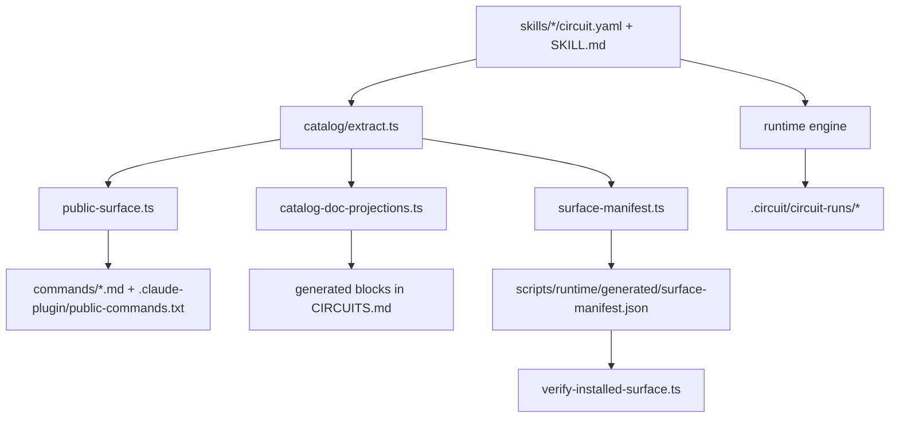
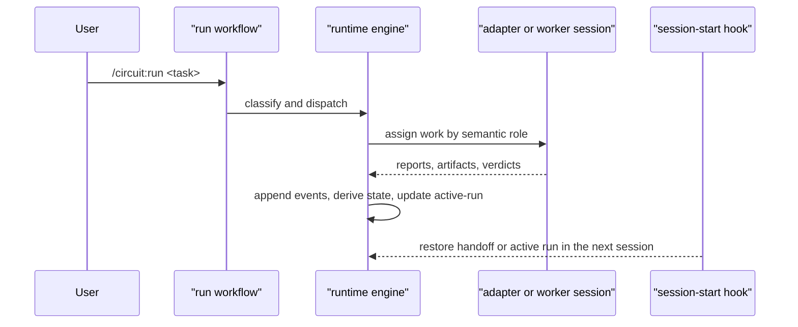
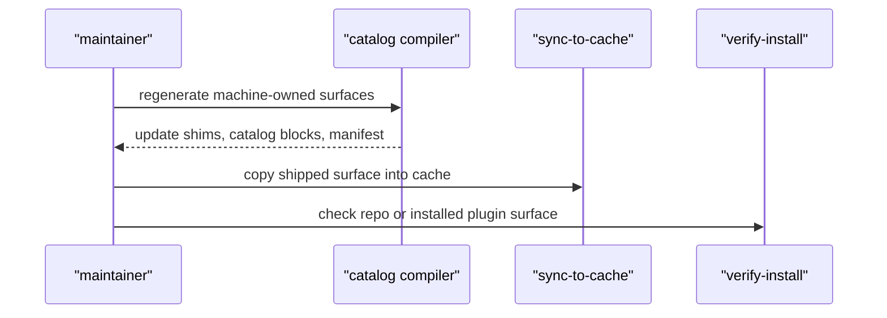

# Circuit Narrative Walkthrough

> Narrative architecture walkthrough for internal use.
>
> This guide is explanatory and human-owned: it connects the moving parts,
> names the important boundaries, and points to the modules that own them, but
> it is not a generated contract.
>
> For concise reference, read [ARCHITECTURE.md](../ARCHITECTURE.md). For the
> ownership map, read
> [docs/control-plane-ownership.md](control-plane-ownership.md). For the
> generated catalog and entry-mode listings, read [CIRCUITS.md](../CIRCUITS.md).

---

## §1. The Problem Circuit Is Trying To Solve

Circuit exists because "ask an agent to do the thing" is not a durable workflow
by itself. A useful automation layer has to survive `/clear`, survive a crashed
session, keep public command surfaces in sync with authored skills, and make it
possible to verify what the plugin actually ships.

That means Circuit is not only a runtime. It is also a small control plane. One
part of the system executes workflows and records durable state under
`.circuit/`. Another part reads authored skills, projects machine-owned
surfaces, and verifies the shipped install surface. The codebase is easier to
reason about once those two jobs stop blending together.

This guide follows that split. We start with the vocabulary, then trace the
authored inputs into the catalog, then follow the runtime path that turns those
authored workflows into resumable runs.

---

## §2. The Working Vocabulary

Circuit uses a small set of terms, but they do a lot of work:

- A **workflow** is a public circuit defined by both
  `skills/<slug>/circuit.yaml` and `skills/<slug>/SKILL.md`.
- A **utility** is public but not a workflow. `review` and `handoff` are the
  important examples.
- An **adapter** is shipped but internal. `workers` is the clearest example:
  workflows depend on it, but it should not be treated as a public slash
  command.
- A **run** is one execution rooted under `.circuit/circuit-runs/<slug>`.
- An **artifact** is the durable output of a step. Circuit treats artifacts as
  state, not as a loose transcript.
- The **catalog** is the normalized list of workflow, utility, and adapter
  entries extracted from `skills/*`.
- The **surface manifest** is the generated inventory of the files the plugin
  claims to ship.

Two distinctions matter immediately.

First, identity and execution are different concerns. A workflow's identity
comes from authored files under `skills/<slug>/`; execution behavior comes from
the runtime engine and relay layer that interpret those files.

Second, public visibility is not a naming convention. It is a role decision
that the catalog compiler turns into generated command shims, public command
inventories, and shipped-surface metadata.

---

## §3. Two Planes, One System

Circuit is easiest to understand as two cooperating planes.

- The **runtime plane** executes workflows, writes artifacts, records events,
  rebuilds state, and resumes interrupted runs. Most of that work lives under
  `scripts/runtime/engine/src/` plus the relay scripts in `scripts/relay/`.
- The **control plane** turns authored skills into a typed catalog, projects the
  public command surface, renders generated catalog blocks, and verifies the
  shipped plugin surface. Those responsibilities live mostly under
  `scripts/runtime/engine/src/catalog/`.

The important idea is that these planes cooperate without sharing ownership of
the same facts. The runtime does not derive workflow identity from narrative
docs. The control plane does not inspect chat transcripts to decide what a run
did. Each plane consumes a narrow, named set of inputs.

---

## §4. Authored Skills Become a Catalog

`scripts/runtime/engine/src/catalog/extract.ts` is where authored text becomes a
typed catalog entry. It walks `skills/*`, reads `SKILL.md` frontmatter, checks
for `circuit.yaml`, and normalizes the result into workflow, utility, and
adapter entries.

The classification rule is deliberately simple:

- If `skills/<slug>/circuit.yaml` exists, the entry is a workflow.
- If it does not exist, `SKILL.md` frontmatter must declare
  `role: utility|adapter`.

That rule matters because it keeps runtime identity in authored sources rather
than spreading it across docs or generated files. The extractor also enforces a
few other architectural constraints that keep later stages predictable:

- The frontmatter `name` must match the skill directory.
- Workflow slash identity is derived from the slug, not handwritten into the
  manifest.
- Legacy manifest fields such as `entry.command` and `expert_command` are not
  allowed to define public identity.
- `entry.usage` remains the stable way for a workflow such as `run` to publish a
  suffix like `<task>` without changing the command id itself.

This is also where `run` becomes easier to understand. `skills/run/circuit.yaml`
is not a special runtime carveout. It is an authored workflow whose job is to
classify a task, select a rigor profile, and dispatch into one of the other
workflows.

Once the extractor has built the catalog, every later projection is supposed to
consume that catalog rather than rediscover facts on its own.

---

## §5. Public Commands Are Projected, Not Handwritten

`scripts/runtime/engine/src/catalog/public-surface.ts` takes the catalog and
decides which entries are public. The policy is narrow and easy to explain:
workflows and utilities are public; adapters are not.

That policy feeds three visible outputs:

- `commands/*.md` command shims
- `.claude-plugin/public-commands.txt`
- the public command portion of
  `scripts/runtime/generated/surface-manifest.json`

`scripts/runtime/engine/src/catalog/generate-targets.ts` is the registry that
ties those outputs together. It makes the catalog compiler's write set explicit
instead of letting generation sprawl into unrelated files.

`scripts/runtime/engine/src/catalog/catalog-doc-projections.ts` handles a
separate projection: the generated blocks inside `CIRCUITS.md`. That split is
important. `CIRCUITS.md` is a generated catalog/reference surface. Narrative
docs such as `README.md`, `ARCHITECTURE.md`, and this guide stay human-authored.

This is one of the quiet strengths of the repo. The control plane owns the
mechanical restatements. Human-owned docs explain how the pieces fit together
without pretending to be the source of truth for runtime identity or public
command derivation.

---

## §6. The Shipped Surface Is a Contract

The next question is not "what is public?" but "what does the plugin claim to
ship, and how is that claim checked?"

Circuit answers that with a layered set of modules:

- `surface-roots.ts` defines which top-level roots count as installed surface
  and which repo-time seed paths should be inventoried.
- `surface-fs.ts` walks those roots, records file facts, and handles hashing and
  executable-bit checks.
- `surface-inventory.ts` turns repo files into a repo-time installed-surface
  inventory.
- `surface-manifest.ts` renders that inventory into
  `scripts/runtime/generated/surface-manifest.json`.
- `verify-installed-surface.ts` compares the actual filesystem to the manifest.
- `scripts/runtime/engine/src/cli/verify-install.ts` runs the broader install
  verification flow used before shipping.

The key architectural point is that the manifest is an inventory, not proof by
itself. The verifier still checks the real installed filesystem. That is why the
repo has both a generated manifest and an install verification path instead of
trying to let one stand in for the other.

This shipped-surface story also lines up with the cache sync flow.
`scripts/sync-to-cache.sh` copies the same surface that the manifest describes
and the verifier checks. The goal is not just to list files; it is to keep
generation, cache sync, and install verification talking about the same shape of
plugin.

---

## §7. Runtime Execution Is an Artifact Chain Backed by Events

On the runtime side, Circuit treats the run directory as the source of truth.
`scripts/runtime/engine/src/derive-state.ts` replays `events.ndjson` into
`state.json`, and the state model keeps separate slots for artifacts, jobs,
checkpoints, and routes.

Build is the first workflow where that outer runtime is now real rather than
aspirational. The semantic outer CLI lives in
`scripts/runtime/engine/src/cli/circuit-engine.ts`, is shipped through
`scripts/runtime/bin/circuit-engine.js`, and is called from
`scripts/relay/circuit-engine.sh`. Build uses semantic commands such as
`bootstrap`, `complete-synthesis`, `request-checkpoint`, `resolve-checkpoint`,
`dispatch-step`, `reconcile-dispatch`, `reopen-step`, `resume`, and `render`
instead of teaching the skill prose to append raw events directly.

That separation is not bookkeeping for its own sake. Each piece answers a
different question:

- artifacts: what durable outputs exist
- jobs: what worker dispatches happened
- checkpoints: what decisions are waiting on the user
- routes: where the workflow graph goes next

The workflow manifests make that runtime contract concrete. Files such as
`skills/build/circuit.yaml`, `skills/repair/circuit.yaml`, and
`skills/sweep/circuit.yaml` declare steps, reads, writes, gates, and routes.
The runtime stays generic because the authored workflows are explicit about the
files they write and the conditions that let a step advance. Build was
realigned to a fixed graph so the manifest and `skills/build/SKILL.md` now
describe the same outer execution path.

This is where Circuit's bias toward durable state shows up most clearly.
Artifacts under `.circuit/circuit-runs/<slug>/artifacts` matter more than a chat
transcript because they are the pieces the runtime can validate, replay, and
resume.

---

## §8. Resume and Continuity Prefer Replay Over Guesswork

`scripts/runtime/engine/src/resume.ts` treats replay as the authoritative way to
recover a run. If `events.ndjson` is newer than `state.json`, the runtime
rebuilds state before trusting it. That keeps resume logic aligned with the
event log instead of optimistically treating a stale projection as good enough.

Circuit also carries continuity across sessions in two different ways on
purpose:

- `active-run.md` is the passive runtime dashboard for the indexed current run.
  For event-backed runs it is generated from `state.json`; legacy workflows
  still maintain it manually until they migrate.
- the continuity control plane is the intentional high-signal summary written
  through the `handoff` utility into `.circuit/control-plane/`.

`hooks/session-start.sh` resolves those sources in a deliberate order:
pending continuity record first, then indexed `current_run`, then nothing. When
the chosen run contains `circuit.manifest.yaml`, SessionStart refreshes the
dashboard through `circuit-engine render` before printing a compact
context-only banner. Resume stays explicit through `/circuit:handoff resume`;
the hook no longer injects saved continuity directly into the fresh session.

---

## §9. Dispatch Is Semantic; Adapters Are Transports

`scripts/runtime/engine/src/dispatch.ts` resolves how work is dispatched.
`scripts/runtime/engine/src/config.ts` resolves where dispatch configuration
comes from. Together they keep a useful boundary in place: workflow manifests
declare intent, while config selects transport.

That boundary lets a workflow ask for an implementer or reviewer without baking
Codex, Agent, or any custom wrapper directly into `circuit.yaml`.
Dispatch resolution follows a clear precedence order:

1. explicit adapter override
2. `dispatch.roles.<role>`
3. `dispatch.circuits.<circuit>`
4. `dispatch.default`
5. auto-detect

This matters because it keeps authored workflow logic stable while still
allowing transport to be adapted to a repo, machine, or personal setup.
The workflow describes the job to do; the adapter describes how that job reaches
another session or process.

---

## §10. `workers` Is Internal on Purpose

`skills/workers/SKILL.md` declares `role: adapter`, and that one choice has a
lot of architectural consequences.

`workers` ships because workflows depend on it for bounded
implement-review-converge loops, but it does not become a public slash command.
That behavior follows naturally from the public-surface projection described in
§5:

- `extract.ts` classifies `workers` as an adapter
- `public-surface.ts` excludes adapters from public command projection
- `release-integrity.test.ts` guards the expectation that `workers` stays out of
  public command inventories and user-facing public docs

This is an important boundary to preserve mentally. `review` and `handoff` are
public utilities. `workers` is internal orchestration plumbing. They all live
under `skills/`, but they do not all occupy the same user-facing layer.

The relay layer reinforces that internal role. `scripts/relay/compose-prompt.sh`
assembles prompts from a task-specific header, selected skills, and relay
templates, while `scripts/relay/update-batch.sh` owns `batch.json` state
transitions. The point is to make the worker loop deterministic enough that the
parent workflow can trust its artifacts and verdicts.

---

## §11. Verification Is Layered

Circuit uses several different verification layers, and they are healthy
because they are not all checking the same thing.

- Catalog freshness checks such as `catalog-compiler.js generate --check` and
  the catalog validator tests guard machine-owned generated surfaces.
- `release-integrity.test.ts` guards a small set of public-surface expectations,
  including the rule that `workers` must stay internal.
- Installed-surface verification modules and tests check that the manifest and
  the actual plugin filesystem still agree.
- Runtime schemas, gates, and replay logic check whether a specific run can
  advance safely.

That layering is worth remembering because it explains why some truths belong in
generated files, some belong in tests, and some belong only in explanatory docs.
The system does not need one giant test to prove everything. It needs each layer
to validate the facts it actually owns.

---

## §12. Runtime Flow and Maintenance Flow Are Different Paths

Two day-to-day flows matter in Circuit, and it helps to describe them
separately.

The **runtime flow** is what users trigger:

The **maintenance flow** is what maintainers trigger:

Keeping those paths distinct prevents a lot of confusion.

- `/circuit:run` is an authored workflow, not a hardcoded one-off command.
- The runtime engine serves multiple workflows without each workflow needing its
  own execution machinery.
- The control plane is maintenance infrastructure, not part of the user hot
  path.

Those boundaries are also why handwritten docs can stay explanatory. The runtime
and control plane already have named owners for machine-owned facts, so the docs
do not need to impersonate a second compiler.

---

## §13. Where To Look Next

When you are changing Circuit, the fastest way to stay oriented is to pick the
document that matches the question you are asking:

- Read [ARCHITECTURE.md](../ARCHITECTURE.md) for the concise internal
  architecture reference.
- Read [docs/control-plane-ownership.md](control-plane-ownership.md) when you
  need the source-of-truth owner for a catalog or verification fact.
- Read [CIRCUITS.md](../CIRCUITS.md) when you need the generated catalog,
  command list, or entry-mode reference.
- Return to this guide when you need the narrative explanation for why those
  parts fit together the way they do.

The recurring theme across the codebase is simple: authored workflow definitions
feed a compiler-controlled catalog, the runtime executes those workflows as
durable artifact chains, and verification stays layered so each owner validates
its own surface. Once that mental model clicks, most of the repo stops feeling
like special cases and starts feeling like a set of cooperating boundaries.
