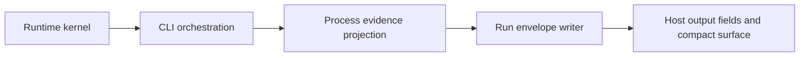

# Run Envelope Projection-Only Refactor Plan V1

Status: Draft plan. Not current behavior.
Date: 2026-05-28

## Purpose

Refactor the Run envelope so it consumes normalized process evidence
projections only.

The goal is not to change what Run does for the operator. The goal is to keep
the Run envelope from becoming a second runtime. Runtime-shaped data should be
adapted before it reaches the envelope. The envelope should decide whether Run
can close, what evidence proves that, what decision packet is needed, and what
small host surface to show.

## Current Boundary Evidence

The code is already close to this target, but the boundary is not enforced yet.

- `src/run-envelope/source-record.ts:4-13` imports process-evidence projectors,
  the process-evidence writer, and `RunResult`.
- `src/run-envelope/source-record.ts:32-70` accepts runtime-shaped child input:
  a closed child with `runResult` and `resultPath`, or a checkpoint-waiting
  child with raw checkpoint fields.
- `src/run-envelope/source-record.ts:506-534` builds and writes the
  `ProcessEvidenceProjection` inside the envelope writer.
- `src/run-envelope/source-record.ts:527-718` mostly operates on the projection
  after that point. This is the part we want to keep.
- `src/process-evidence/projection.ts:120-213` already owns the closed-process
  and checkpoint-waiting projection builders plus the projection writer.
- `src/cli/circuit.ts:773-787`, `src/cli/circuit.ts:973-998`, and
  `src/cli/circuit.ts:1065-1083` call the source Run envelope writer with
  runtime-shaped child input.
- `tests/contracts/run-centered-v1-safety.test.ts:52-67` already ratchets the
  future Run envelope away from runtime executor internals and private report
  paths, but it does not yet forbid `RunResult` or projection-builder imports.

The simplest reading is: the envelope's internal logic is mostly right, but its
input seam is too wide.

## Target Boundary



The ownership split should be:

| Layer | Owns | Does not own |
| --- | --- | --- |
| Runtime kernel | Running the selected process, checkpoint state, raw result files | Run closure policy, compact host surface |
| Process evidence | Adapting runtime results and checkpoint state into `ProcessEvidenceProjection` | Run completion gate, decision packets, host output |
| Run envelope | Goal contract, process plan, attempts, completion gate, decision packets, memory update events, compact surface | Runtime result parsing, checkpoint adaptation, projection writing |
| CLI orchestration | Sequencing runtime -> operator summary -> process evidence -> Run envelope -> stdout | Envelope policy, projection schema rules |
| Host surfaces | Showing succinct fields and generated artifacts | Runtime or envelope decisions |

This keeps the main flow one-way:

1. Runtime produces facts.
2. Process evidence normalizes those facts.
3. Run envelope evaluates the normalized projection.
4. Host surfaces display the result.

## Proposed Contract

Change the source envelope writer from this shape:

```ts
writeRunEnvelopeRecord({
  runFolder,
  operatorIntent,
  selectedProcess,
  child: { kind: 'closed', runResult, resultPath },
  recordedAt,
});
```

To this shape:

```ts
writeRunEnvelopeRecord({
  runFolder,
  operatorIntent,
  selectedProcess,
  processEvidence: {
    path: processEvidencePath,
    projection,
  },
  recordedAt,
});
```

The Run envelope may import:

- `ProcessEvidenceProjection` types and schema-level constants.
- `Ref`, Run envelope schemas, and ID schemas.

The Run envelope should not import:

- `RunResult`.
- Runtime executors.
- Process-evidence projector functions.
- The process-evidence writer.
- Flow catalog helpers.

If the envelope needs a path constant such as `reports/process-evidence.json`,
move that constant to a neutral schema or paths module instead of importing the
projection writer module just to get it.

Define any `WrittenProcessEvidence` helper type in the envelope module or a
neutral schema module. Do not define it in the projection writer module if that
would force the envelope to import active adapter code. The path may be absolute
or run-relative, as long as the envelope normalizes it before creating evidence
refs.

## One Schema Gap

The current envelope summary uses `input.child.runResult.summary` for closed
processes. A projection-only writer cannot read that value from the child result.

Add a small `summary: string` field to `ProcessEvidenceProjection`.

Why this belongs in process evidence:

- It is normalized process output.
- It is already available when projecting a closed `RunResult`.
- Checkpoint-waiting projections can use the existing checkpoint waiting
  summary text.
- The envelope can then build process attempts without reaching back into
  runtime-shaped data.

This is the only expected process-evidence schema addition for this refactor.

## Slice Plan

### Slice 0: Plan Only

Land this document and index it from `docs/specs/README.md`.

No runtime behavior changes.

### Slice 1: Strengthen Process Evidence As The Adapter

Add `summary` to `ProcessEvidenceProjection`.

Update process-evidence projection tests so every projection case proves:

- closed complete projections carry the child result summary;
- blocked, failed, handoff, and aborted projections carry an honest summary;
- checkpoint-waiting projections carry the checkpoint waiting summary;
- old required evidence rules still hold.

Keep this slice below the Run envelope. The envelope should not change yet.

### Slice 2: Add Projection-Only Envelope Entry Point

Introduce the new source writer input that accepts written process evidence:

```ts
type WrittenProcessEvidence = {
  readonly path: string;
  readonly projection: ProcessEvidenceProjection;
};
```

Then move the existing envelope logic onto that input.

Remove from `src/run-envelope/source-record.ts`:

- `ClosedChild`;
- `CheckpointWaitingChild`;
- `buildProjection`;
- `RunResult` imports;
- process-evidence projector imports;
- process-evidence writer imports.

Add a small helper that extracts the child run id from the parsed projection.
The schema already requires `child_run_ref` to be a trace ref, so the current
fallback zero UUID in `src/run-envelope/source-record.ts:567` should disappear.

### Slice 3: Move Projection Construction To The CLI Sequence

At each source Run envelope call site, build and write process evidence before
calling the envelope writer:

- checkpoint resume path at `src/cli/circuit.ts:773-787`;
- fresh checkpoint-waiting path at `src/cli/circuit.ts:973-998`;
- fresh closed path at `src/cli/circuit.ts:1065-1083`.

The CLI already has the runtime result, result path, checkpoint path, route, and
run folder. It is the right sequencing layer.

Keep the stdout JSON shape stable. `runEnvelopeOutputFields` should not change
unless a test proves the old shape is impossible to preserve.

### Slice 4: Rewrite Envelope Writer Tests Around Projections

Update `tests/runner/run-envelope-source-writer.test.ts` so fixtures create and
write process evidence first, then pass the written projection into the Run
envelope writer.

The test should still prove the same behavior:

- complete Run closes only with required evidence;
- checkpoint waiting creates a decision packet;
- missing process evidence prevents false completion;
- memory update events remain hint-only and visible;
- stopped or failed child processes do not close as complete.

### Slice 5: Add Boundary Ratchets

Expand `tests/contracts/run-centered-v1-safety.test.ts` with structural checks
that fail if the source envelope path:

- imports `RunResult`;
- imports runtime modules;
- imports process-evidence projector or writer functions;
- reintroduces `ClosedChild` or `CheckpointWaitingChild`;
- contains a fallback zero UUID for a child run id;
- hard-codes private flow report paths.

Prefer import-graph checks where possible. Use grep checks only for small,
explicit strings that represent boundary regressions.

Scope this ratchet to `src/run-envelope/source-record.ts` and any new
non-shadow source envelope helpers. Do not let the shadow writer create a false
failure while it remains a migration aid. If the shadow writer keeps
runtime-shaped input, record that as a named temporary exception and keep it out
of the source envelope import allowlist.

### Slice 6: Decide Shadow Writer Fate Separately

Do not let the shadow writer complicate this refactor.

The source writer should become projection-only first. After that, choose one of
two small follow-ups:

- keep the shadow writer runtime-shaped until it is deleted; or
- move the shadow writer to the same projection-only contract if it is still
  needed for parity checks.

The shadow writer is a migration aid, not part of the target architecture.
Its exception should not be allowed to justify runtime-shaped input in the
source writer.

### Slice 7: Full Verification And Review

Run focused tests first:

```bash
npm run test -- tests/contracts/process-evidence-projection-schema.test.ts tests/runner/run-envelope-source-writer.test.ts tests/contracts/run-envelope-record-schema.test.ts tests/contracts/run-centered-v1-safety.test.ts
npm run test -- tests/runner/cli-run-envelope-shadow.test.ts tests/runner/history-run-start-recall.test.ts
```

Then run the canonical repo checks:

```bash
npm run check
npm run lint
npm run check-flow-drift
npm run verify:fast
npm run verify
```

Finish with two adversarial reviews:

1. Boundary review: can `src/run-envelope` still see runtime-shaped data?
2. Behavior review: did any operator-visible Run output drift without intent?

## Rollback Points

Each slice should be independently reversible.

- Slice 1 can roll back by removing `summary` from the projection schema and
  tests.
- Slice 2 can roll back to the old writer input before CLI call sites change.
- Slice 3 can roll back by moving projection construction back into the writer,
  though that should fail the new ratchets once Slice 5 lands.
- Slice 5 can be loosened only if a source-backed design note explains why the
  envelope truly needs the forbidden dependency.

Do not combine Slice 2 and Slice 5 in a way that makes rollback unclear. Land
the behavior-preserving contract change first, then lock it.

## Acceptance Checks

This refactor is done when:

- `src/run-envelope/source-record.ts` accepts process evidence projections only.
- `src/run-envelope/source-record.ts` and any non-shadow source envelope helpers
  do not import `RunResult`, runtime modules, process-evidence projectors, or
  the process-evidence writer.
- Runtime result and checkpoint adaptation lives in `src/process-evidence/` and
  the CLI sequence that calls it.
- Run envelope records still contain the same goal contract, process plan,
  process attempts, completion gate, decision packets, memory update events,
  and compact surface semantics.
- Checkpoint resume authority remains in runtime/checkpoint code, not in the
  Run envelope.
- Memory remains hint-only.
- Skill moments remain policy/provenance metadata, not envelope routing power.
- Host-native skill roots and generated host packages are unchanged unless
  generated by the normal drift workflow.
- Existing old Goal and child result artifacts remain readable.
- Focused tests and `npm run verify` pass.
- Two adversarial reviews find no medium-or-higher boundary or behavior issues.

## What Not To Do

- Do not move runtime execution into `src/run-envelope`.
- Do not let the envelope inspect flow-owned private report shapes.
- Do not let the envelope decide checkpoint resume mechanics.
- Do not turn this into a public terminology change.
- Do not use this refactor to ship default skill mappings or package skills.
- Do not make the CLI own envelope policy. The CLI should sequence calls, not
  decide whether Run is done.

## Downstream Effect

After this refactor, the Run envelope should be easier to keep small. It can
only judge the normalized facts placed in front of it. That makes the intended
architecture harder to accidentally undo: runtime runs work, process evidence
normalizes proof, and Run decides whether the work can honestly close.
